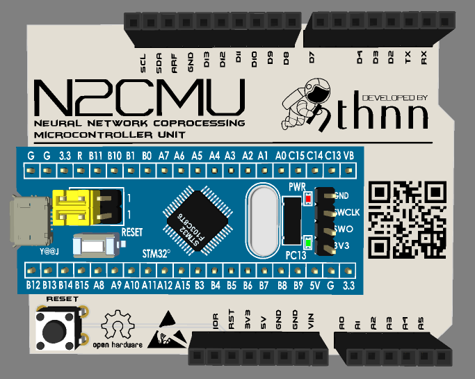
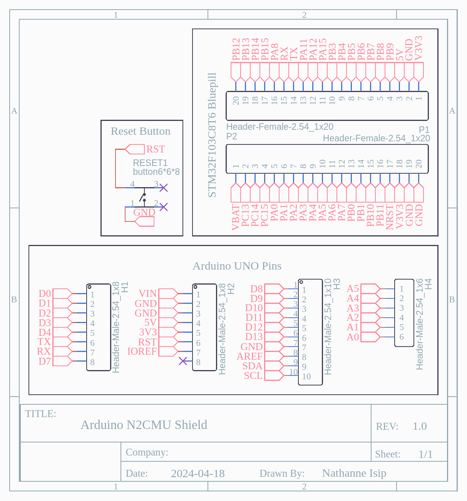

# N2CMU Arduino Library

  

[](https://github.com/nthnn/SIM900/blob/main/LICENSE)

This is the official Arduino library for [N2CMU](https://github.com/nthnn/n2cmu) (Neural Network Coprocessing Microcontroller Unit).

<p align="center">
    
</p>

## Getting Started

To start using `n2cmu-arduino` library in your Arduino projects, follow these simple steps:

1. Open your Library Manager on Arduino IDE.
2. Type `n2cmu-arduino` and click "Install."

Alternatively, you can follow the steps below:

1. Download the `n2cmu-arduino` library from the GitHub repository.
2. Extract the downloaded archive and rename the folder to `n2cmu-arduino`.
3. Move the `n2cmu-arduino` folder to the Arduino libraries directory on your computer.

    - Windows: `Documents\Arduino\libraries\`
    - MacOS: `~/Documents/Arduino/libraries/`
    - Linux: `~/Arduino/libraries/`

4. Launch the Arduino IDE.

## Example Usage

Below is an example usage of N2CMU Arduino library that demonstrates an example training for NAND gate training and inference.

```cpp
#include <n2cmu.h>

void setup() {
    // Initialize serial communication
    Serial.begin(9600);
    while(!Serial);

    // Initialize the N2Coprocessor instance
    N2Coprocessor coprocessor;
    if(coprocessor.begin())
        Serial.println(F("Co-processor initialized!"));
    else {
        Serial.println(F("Something went wrong. Halting..."));
        while(true);
    }

    // Reset the CPU
    if(coprocessor.cpuReset())
        Serial.println(F("CPU Resetted!"));
    else {
        Serial.println(F("Something went wrong. Halting..."));
        while(true);
    }

    // Initialize neural network with 2 input, 2 hidden, and 1 output neurons
    Serial.println(F("Initializing neural network..."));
    coprocessor.createNetwork(2, 2, 1);
    coprocessor.setEpochCount(4000);

    // Define training dataset and corresponding output
    float dataset[][2] = {{0, 0}, {0, 1}, {1, 0}, {1, 1}};
    float output[][1] = {{1}, {1}, {1}, {0}};

    // Start network training
    Serial.println(F("Starting network training..."));
    if(coprocessor.train((float*) dataset, (float*) output, 4, 1.0f))
      Serial.println(F("Training done!"));
    else {
        Serial.println(F("Something went wrong. Halting..."));
        while(true);
    }

    // Perform inferences
    Serial.println(F("Attempting inferences..."));
    for(uint8_t i = 0; i < 4; i++) {
        float output[1];
        if(coprocessor.infer(dataset[i], output)) {
            Serial.print(F("\t["));
            Serial.print(dataset[i][0]);
            Serial.print(F(", "));
            Serial.print(dataset[i][1]);
            Serial.print(F("]: "));
            Serial.println(output[0]);
        }
        else Serial.println(F("Inference attemp failed."));
    }

    // Reset the network
    Serial.println(F("Inference done, resetting network."));
    coprocessor.resetNetwork();
}

void loop() {
    delay(1000);
}
```

## PCB Schematic Diagram



## License

Copyright (c) 2024 Nathanne Isip

`n2cmu-arduino` is distributed under the GNU General Public License v3.0. For further details, refer to the LICENSE file.

```
This program is free software: you can redistribute it and/or modify  
it under the terms of the GNU General Public License as published by  
the Free Software Foundation, version 3.

This program is distributed in the hope that it will be useful, but 
WITHOUT ANY WARRANTY; without even the implied warranty of 
MERCHANTABILITY or FITNESS FOR A PARTICULAR PURPOSE. See the GNU 
General Public License for more details.

You should have received a copy of the GNU General Public License 
along with this program. If not, see <http://www.gnu.org/licenses/>.
```